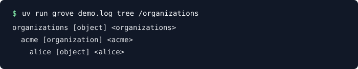

# GROVE

[](https://github.com/yoits9090/grove/actions/workflows/evals.yml)

GROVE is a small, typed, persistent object-tree database. Nodes are independently addressable objects with stable IDs, names, types, properties, one parent, and ordered children.

<p align="center">
  
</p>

The repository is a correctness-first **0.1 vertical slice**. It is not the complete database vision: the implementation favors explicit invariants, deterministic behavior, and crash-tested local durability over pretending to solve every scale or distribution problem.

## Current slice

- Stable opaque IDs, derived absolute paths, ordered children, unique sibling names, and cycle-safe moves.
- Create, read, update, delete, rename, move, copy, transactions, optimistic conflict detection, and subscriptions.
- Typed properties including null, booleans, numbers, strings, bytes, timestamps, arrays, maps, and non-owning references.
- JSON subtree import/export with explicit tagged encodings.
- Detached snapshot queries, typed predicates, lazy traversal, and lightweight in-memory property indexes.
- Optional schemas for node types and property constraints with atomic validation.
- A checksummed append-only snapshot backend and an experimental SQLite WAL backend with relational ordered edges.
- A small SQLite online-backup history API (`SQLiteHistory`, `Snapshot`).
- A CLI for tree inspection, node retrieval, and export.

The SQLite backend and several advanced storage ideas remain explicitly scoped experiments. See [`docs/roadmap.md`](docs/roadmap.md) and [`docs/decisions.md`](docs/decisions.md).

## Quick start

```python
from grove import TreeStore

store = TreeStore()
organizations = store.create("organizations")
acme = store.create("acme", parent=organizations.id, type="organization")
alice = store.create(
    "alice",
    parent=acme.id,
    type="user",
    properties={"active": True},
)

store.move(alice.id, "/organizations")
print(store.path(alice.id))
# /organizations/alice
```

Durable local storage:

```python
from grove import SQLiteTreeStore

with SQLiteTreeStore("grove.db") as db:
    db.create("system")
```

CLI:

```bash
uv run grove grove.db tree
uv run grove grove.db get /system
```

## Optional schemas

Pass a `Schema` to validate node types and properties atomically:

```python
from grove import Schema, SchemaValidationError, TreeStore

schema = Schema({
    "person": {
        "properties": {
            "name": {"type": str, "required": True},
            "age": int,
        },
        "required": ["name"],
        "allow_extra": False,
    },
})

db = TreeStore(schema=schema)
db.create("alice", type="person", properties={"name": "Alice", "age": 42})
```

## Development notes

- The in-memory `TreeStore` is the reference model.
- `PersistentTreeStore` is the conservative crash-testable persistence baseline.
- `SQLiteTreeStore` is the local durable scale experiment: WAL, foreign keys, ordered relational edges, bounded writer waits, online backup, and durable revisions.
- Content-addressed snapshots, Merkle hashing, incremental SQLite writes, and direct SQL indexes live under `experiments/` and are not silently promoted into the public API.

Run the full suite with `uv run python -m pytest -q`. Reproducible workloads live in `benchmarks/`.
